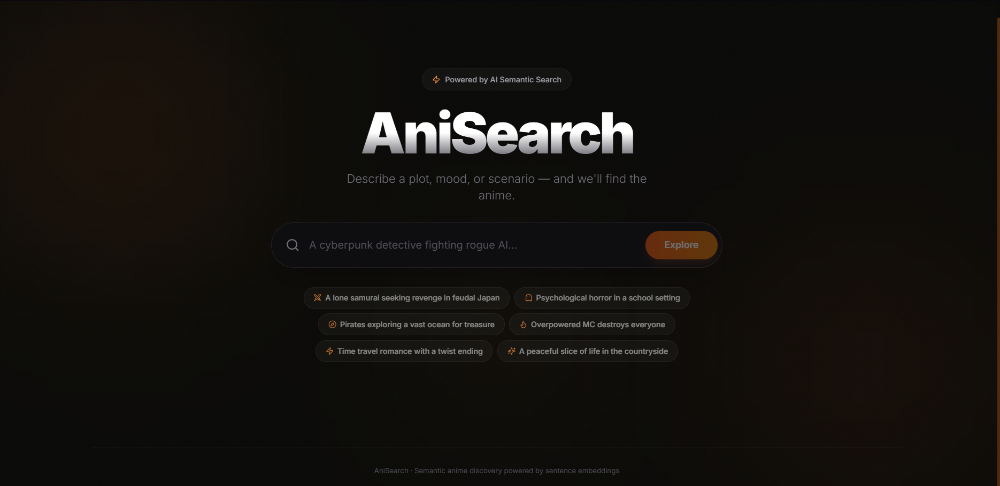
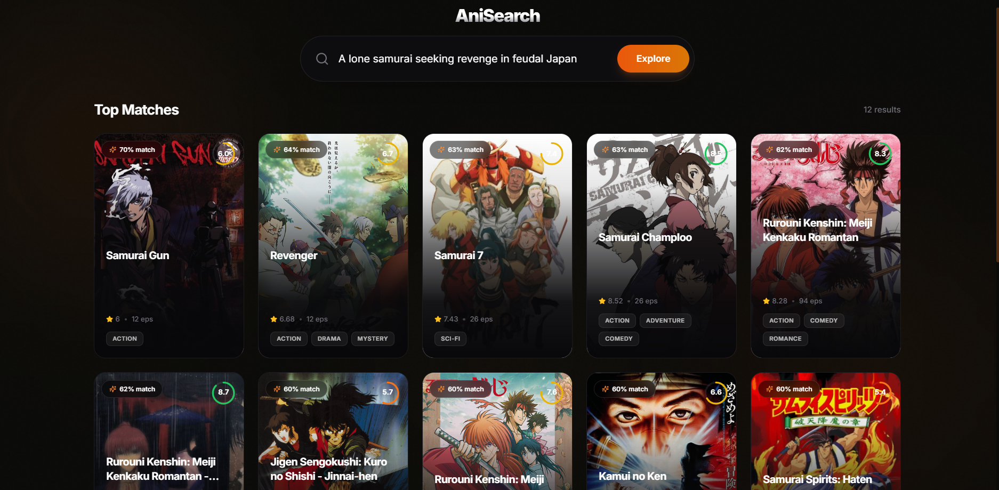
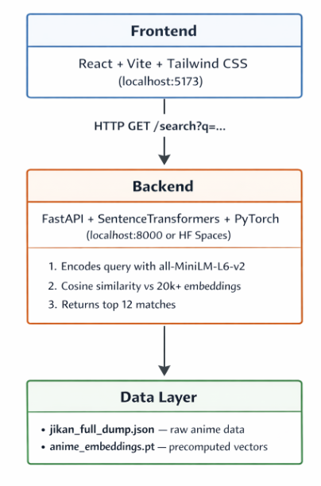

# AniSearch — AI-Powered Semantic Anime Discovery


AniSearch is a next-generation anime discovery engine. Instead of relying on exact keyword matches, it uses **Natural Language Processing (NLP)** and **vector embeddings** to let users search for anime based on plot descriptions, hyper-specific tropes, or general "vibes."

> *"A cyberpunk detective fighting rogue AI in a dystopian city"*
> *"Psychological horror in a school setting"*
> *"Overpowered MC destroys everyone"*

---

## Preview 




Live preview - [Click Here](https://anisearch557.vercel.app)

---

## Features

- **Semantic Search** — Describe what you want in plain English; no need to know exact titles
- **20,000+ Anime** — Full dataset scraped from the [Jikan API](https://jikan.moe/) (MyAnimeList)
- **Poster Art & Scores** — Results display cover images, MAL ratings, episode counts, and genre tags
- **Instant Suggestions** — One-click suggestion chips to explore popular queries
- **Responsive UI** — Premium dark-themed interface built with React + Tailwind CSS

---

## Architecture



---

## Getting Started

### Prerequisites

- **Python 3.9+** with pip
- **Node.js 18+** with npm

### 1. Clone the repo

```bash
git clone <your-repo-url>
cd Anime
```

### 2. Set up the backend

#### Option A: Run locally

```bash
# Install Python dependencies
pip install fastapi uvicorn sentence-transformers torch

# Generate embeddings (first time only — takes 3-5 min)
python semantic_search.py

# Start the API server
uvicorn server:app --reload --port 8000
```

#### Option B: Deploy to Hugging Face Spaces

The `backend/` folder is a self-contained Docker app ready for [HF Spaces](https://huggingface.co/spaces):

```bash
# Push the backend/ folder to your HF Space repo
# It will auto-build using the Dockerfile and expose port 7860
```

### 3. Set up the frontend

```bash
cd frontend
npm install
npm run dev
```

Open **http://localhost:5173** in your browser.

> **Note:** By default the frontend points to the Hugging Face Space backend (`https://abhay557-animesearch.hf.space`). To use a local backend, update `BACKEND_URL` in `src/App.jsx` to `http://localhost:8000`.

---

##  API Reference

### `GET /search`

Search for anime by natural language description.

| Parameter | Type   | Description                  |
|-----------|--------|------------------------------|
| `q`       | string | User search query (required) |

**Response:**

```json
{
  "results": [
    {
      "title": "Cowboy Bebop",
      "genres": "Action, Adventure, Drama, Sci-Fi",
      "synopsis": "In the year 2071...",
      "episodes": 26,
      "mal_score": 8.75,
      "image": "https://cdn.myanimelist.net/images/anime/4/19644l.webp",
      "score": 0.62
    }
  ]
}
```

- `score` — Cosine similarity (0–1) between query and anime description
- `mal_score` — MyAnimeList community rating (0–10)
- `image` — Poster art URL from MAL

---

##  How It Works

1. **Data Collection** — `scrape.js` streams all anime from the Jikan v4 API into `jikan_full_dump.json`
2. **Embedding Generation** — Each anime's title + genres + synopsis is encoded into a 384-dimensional vector using the [all-MiniLM-L6-v2](https://huggingface.co/sentence-transformers/all-MiniLM-L6-v2) model
3. **Search** — The user's query is encoded into the same vector space and compared against all anime using cosine similarity
4. **Ranking** — Top 12 results above a 0.20 confidence threshold are returned

---

##  Tech Stack

| Layer     | Technology                                          |
|-----------|-----------------------------------------------------|
| Frontend  | React 19, Vite 6, Tailwind CSS 3, Lucide React      |
| Backend   | FastAPI, Uvicorn                                    |
| AI/ML     | Sentence Transformers (all-MiniLM-L6-v2), PyTorch   |
| Data      | Jikan API v4 (MyAnimeList), custom Node.js scraper  |
| Hosting   | Hugging Face Spaces (backend)                       |

---

##  License

This project is for educational and personal use. Anime data is sourced from [MyAnimeList](https://myanimelist.net/) via the [Jikan API](https://jikan.moe/).
